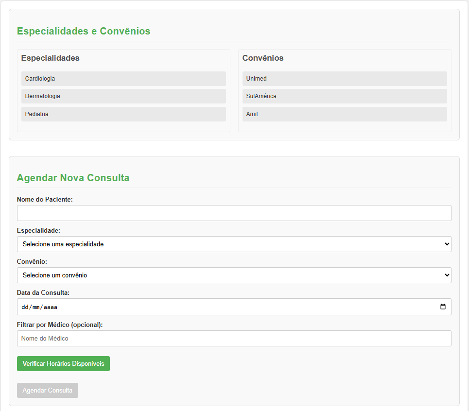
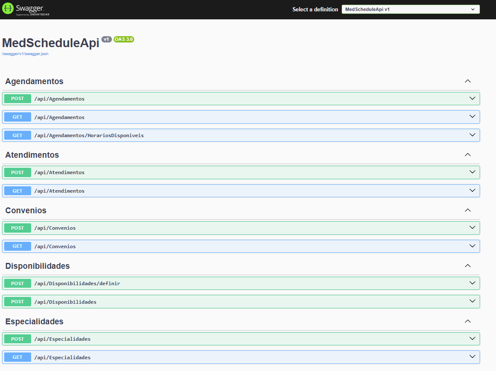

# 🩺 MedSchedule - Sistema de Agendamento Médico

MedSchedule é um sistema completo de **agendamento médico**, com funcionalidades para gerenciar especialidades, convênios, agendamentos e atendimentos. O projeto é dividido em duas partes:

- 🔙 **Backend**: API RESTful construída com **ASP.NET Core**
- 🌐 **Frontend**: Aplicação web desenvolvida em **React.js**

A orquestração é feita com **Docker Compose**, facilitando o deploy de ambos os serviços com um único comando.

---

## 🗂️ Estrutura do Projeto

```
MedSchedule/
├── MedScheduleApi/               # Backend (ASP.NET Core)
│   ├── bin/
│   ├── Controllers/              # Controles da API
│   │   └── AgendamentosController.cs
│   ├── Data/                     # Contexto do Banco de Dados, Migrations, etc.
│   ├── DTOs/                     # Data Transfer Objects (Requisição/Resposta)
│   │   ├── AgendamentoRequestDto.cs
│   │   └── HorarioDisponivelResponseDto.cs
│   ├── Models/                   # Modelos de Entidade (EF Core)
│   ├── obj/
│   ├── Properties/
│   ├── Services/                 # Lógica de Negócio (ex: AgendamentoService)
│   │   └── AgendamentoService.cs
│   ├── .gitignore
│   ├── appsettings.Development.json
│   ├── appsettings.json
│   ├── Dockerfile
│   ├── MedScheduleApi.csproj
│   ├── MedScheduleApi.http
│   ├── Program.cs                # Ponto de entrada da aplicação .NET
│   └── docker-compose.yml        # (Não está na imagem, mas é para o projeto Docker geral)
├── frontend/                     # Frontend (React)
│   ├── assets/
│   ├── node_modules/
│   ├── public/
│   ├── src/
│   │   ├── api/                  # Funções para interagir com a API do backend
│   │   │   └── api.js
│   │   ├── components/           # Componentes React reutilizáveis
│   │   │   ├── Common/
│   │   │   │   ├── Button/
│   │   │   │   ├── Input/
│   │   │   │   ├── Select/
│   │   │   │   └── Text/
│   │   │   └── MedSchedule/
│   │   │       ├── AgendamentoForm/
│   │   │       ├── AgendamentosList/
│   │   │       ├── AtendimentosList/
│   │   │       └── InfoCards/
│   │   ├── pages/                # Páginas principais da aplicação
│   │   │   └── DashboardPage/
│   │   │       └── DashboardPage.js
│   │   ├── styles/               # Arquivos de estilo globais ou temas
│   │   ├── App.css
│   │   ├── App.js                # Componente principal da aplicação
│   │   ├── index.css
│   │   └── index.js              # Ponto de entrada do React
│   ├── .gitignore
│   ├── Dockerfile
│   ├── nginx.conf                # (Se você estiver usando Nginx para servir o frontend)
│   ├── package-lock.json
│   └── package.json
├── docker-compose.yml            # Arquivo de orquestração Docker para ambos (backend e frontend)
└── README.md
```

---

## 🛠️ Tecnologias Utilizadas

| Camada     | Tecnologias                          |
|------------|--------------------------------------|
| Backend    | ASP.NET Core, Entity Framework Core  |
| Banco      | In-Memory (para dev)                 |
| Frontend   | React.js, Styled-Components          |
| Orquestração | Docker, Docker Compose             |

---

## 🖼️ Imagens do Projeto

### 💻 Interface Web (Frontend)



### 🧪 API com Swagger (Backend)



---

## 🚀 Como Executar o Projeto

### 1. Pré-requisitos

- [Docker Desktop](https://www.docker.com/products/docker-desktop) instalado e em execução

### 2. Clone o repositório

```bash
git clone https://github.com/seu-usuario/MedSchedule.git
cd MedSchedule
```

### 3. Construir as imagens

```bash
docker-compose build
```

### 4. Iniciar os serviços

```bash
docker-compose up
```

A aplicação estará disponível em:

- 🖥️ Frontend: [http://localhost:3000](http://localhost:3000)
- 📚 Swagger API: [http://localhost:5081/swagger](http://localhost:5081/swagger)

---

## ⚙️ Observações

- **Banco de Dados In-Memory**: Todos os dados são temporários. Reiniciar o backend apaga os dados.
- **Variáveis de Ambiente**: O ambiente do backend está como `Development` para permitir o Swagger.
- **CORS**: Configurado para `http://localhost:3000`. Ajuste conforme necessário no `Program.cs`.

---

## 📦 Comandos Úteis

| Ação                              | Comando                         |
|-----------------------------------|---------------------------------|
| Parar os contêineres              | `docker-compose stop`           |
| Parar e remover contêineres/redes | `docker-compose down`           |
| Executar em modo background       | `docker-compose up -d`          |

---

## 📱 Responsividade

A interface foi construída com **Styled-Components** e **media queries**, adaptando-se a diferentes tamanhos de tela: desktop, tablet e celular.

---

## 📬 Contato

Caso tenha dúvidas ou sugestões, entre em contato:
- 📧 Email: herbertonmiguel@gmail.com
- 💼 LinkedIn: [Herberton Miguel](https://www.linkedin.com/in/herbertonmiguel/)

---

> Projeto desenvolvido para fins educativos e demonstração de habilidades Full Stack com .NET + React + Docker.
